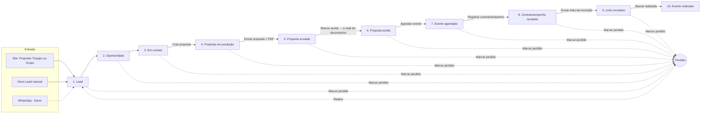

# CRM — Fluxo Comercial em Kanban · Design

**Data:** 15 de setembro de 2026
**Status:** aprovado em conversa com o PO (seções 1–5), aguardando revisão do arquivo
**Substitui:** `docs/17_Migracao_P0_Processo_Comercial_B2G_v1.md` (Janela H inteira) e, no `docs/16`, as Sessões D2, E3 e as Janelas F e G no formato em que estavam. As branches `feat/crm-janela-h4-contratacao` e `feat/crm-biblioteca-comercial-d2` foram descartadas em 14/09/2026 (pontas nas tags `arquivo/*`).
**Precedência:** `CLAUDE.md` continua acima deste documento.

---

## 0. Em uma frase

O CRM deixa de ser um processo governado por portas (qualificação, contratação, handoff) e passa a ser **um quadro kanban onde o Lead é o card**, o **Cliente é o ativo permanente** com linha do tempo e documentos, e as ações do dia a dia — gerar proposta, enviar e-mail, agendar evento — acontecem **dentro do sistema** e movem o card sozinhas.

## 1. Decisões tomadas (com o PO, 14–15/09/2026)

| # | Decisão | Escolha |
|---|---|---|
| 1 | Origem do fluxo | desenhado pelo PO em texto, nesta conversa |
| 2 | Branches H4 e D2 | descartadas (tags `arquivo/feat-crm-janela-h4-contratacao` e `arquivo/feat-crm-biblioteca-comercial-d2`) |
| 3 | Entidade que percorre o quadro | o **Lead**; `oportunidades` some |
| 4 | Clientes e Contatos | Cliente vira ativo central; contatos são array dentro do cliente; `contatos-crm` some |
| 5 | Evento comercial | entidade própria do CRM, sem relação com `eventos` do site; inscrição de participantes é feita em plataforma externa — o CRM só guarda e envia os links |
| 6 | Telas de proposta | uma tela **Propostas**; Versões dentro do detalhe; Condições some |
| 7 | Quais leads entram no CRM | `tipo = proposta` — é o que as abas *Proposta* e *Equipe ou Grupo* do `/contato` gravam, e é o que **Novo Lead** grava (com `origemEntrada: manual`); `contato`, `newsletter` e `candidatura` continuam gravados mas fora do CRM |
| 8 | Desfecho negativo | status **Perdido** ortogonal ao estágio, com motivo; reabrir devolve à coluna de origem |
| 9 | O que move o card | ação move; arrastar é livre; **sem porta dura** |
| 10 | Dados existentes | CRM está vazio em produção (verificado em 15/09: 0 linhas em todas as tabelas do CRM; 19 leads) — **sem migração** |
| 11 | Automações | sessão própria, depois; esta entrega deixa os ganchos (linha do tempo e log de e-mails) |
| 12 | Abordagem | **A — adaptar o que existe** (mantém `leads`, `clientes-crm`, `propostas` e o motor de PDF) |
| 13 | Tela Envios | volta ao menu, com escopo ampliado: tudo que saiu por e-mail do CRM |

## 2. O fluxo

Os 10 estágios são as colunas do kanban, nesta ordem. "Perdido" não é coluna: é um status do lead que o tira do quadro sem apagar nada.

Todo lead do CRM entra automaticamente na coluna **Lead**. "Oportunidade" é marcada à mão.

## 3. Modelo de dados

Convenção: *itálico* = já existe e fica · **negrito** = novo.

### 3.1. `leads` — o card

Mantém tudo que o site grava: *tipo, nome, email, telefone, cargo, instituicao, esfera, detalhesProposta (programa, modalidade, participantesEstimados, mensagem), origem (página, referrer, UTMs), consentimentoLgpd, payloadBruto*. Os grupos `detalhesContato`, `detalhesNewsletter`, `detalhesCandidatura` continuam existindo para os outros tipos.

| Campo | Tipo | Notas |
|---|---|---|
| **estagio** | select (10 valores) | `lead` · `oportunidade` · `em-contato` · `proposta-em-producao` · `proposta-enviada` · `proposta-aceita` · `evento-agendado` · `contrato-recebido` · `links-enviados` · `evento-realizado`. Default `lead`. |
| **perdido** | checkbox | default `false` |
| **motivoPerda** | select | `sem-resposta` · `recusou` · `sem-orcamento` · `cancelado` · `outro` |
| **perdidoEm** | date | |
| **detalhePerda** | text | livre |
| **cliente** | relationship → `clientes-crm` | casado na entrada (§5.1); editável |
| **clienteCasadoPor** | select | `cnpj` · `dominio` · `nome` · `criado` · `manual` |
| **responsavel** | relationship → `users` | |
| **valorEstimado** | number | R$ |
| **dataPrevistaEvento** | date | |
| **observacoes** | textarea | manual |
| **origemEntrada** | select | `site` · `manual` · `whatsapp` (reservado) |
| ~~status~~ | — | o `status` legado (`LEAD_STATUS`) é **removido**; o estágio o substitui |

Índices: `estagio`, `perdido`, `cliente`, `tipo`.

### 3.2. `clientes-crm` — o ativo (rótulo "Clientes" na UI)

Fica: *orgao, sigla, tipo, municipio, uf, esfera, area, cnpj, email, responsavel, observacoes, clienteSite*.
Sai: `potencial`, `proximaAcao`, `status`, `dirigente`, `cargoDirigente`, `origem` (substituído abaixo).

| Campo | Tipo | Notas |
|---|---|---|
| **contatos** | array | `nome` (req.), `cargo`, `setor`, `email`, `whatsapp`, `principal` (bool), `decisor` (bool). No máximo um `principal` (validado em hook). |
| **origem** | select | `lead-site` · `manual` · `importado` |

O slug **não** muda para `clientes`: esse slug já é da coleção de logos institucionais do site. A coleção do CRM segue `clientes-crm` (tabela `clientes_crm`) e só o rótulo na UI é "Clientes". Evita renomear tabela e mexer na coleção do site.

### 3.3. `propostas`, `versoes-proposta`, `envios-proposta`

Ficam como estão. Única mudança em `propostas`: campo `oportunidade` **removido**, campo **`lead`** (relationship → `leads`, obrigatório) adicionado. `cliente` continua obrigatório e é preenchido a partir do lead. O motor de PDF (`apps/cms/src/lib/crm/pdf/`) não muda.

`envios-proposta` continua sendo gravada quando uma proposta é enviada por e-mail (espelho de `envios-email`, §3.6), para o detalhe da proposta continuar listando os envios sem join.

### 3.4. `eventos-comerciais` (nova)

| Campo | Tipo | Notas |
|---|---|---|
| lead | relationship → `leads` | obrigatório |
| cliente | relationship → `clientes-crm` | obrigatório, derivado do lead |
| proposta | relationship → `propostas` | opcional |
| titulo | text | obrigatório |
| dataInicio, dataFim | date | fim opcional |
| modalidade | select | `presencial` · `online` · `hibrido` |
| local | text | cidade/endereço ou link |
| moduloCatalogo | relationship → `modulos` | opcional |
| contratoEmpenho | group | `tipo` (`contrato` · `empenho` · `termo` · `outro`), `numero`, `data`, `valor`, `arquivo` (upload → `documentos-comerciais`) |
| linksInscricao | array | `rotulo`, `url` |
| status | select | `agendado` · `realizado` · `cancelado` |
| observacoes | textarea | |

Sem relação com a coleção `eventos` do site. Um lead pode ter mais de um evento (ex.: duas turmas); o modal mostra o mais recente.

### 3.5. `modelos-email` (nova)

| Campo | Tipo | Notas |
|---|---|---|
| nome | text | obrigatório |
| finalidade | select | `proposta` · `documentos` · `links-inscricao` · `livre` |
| padrao | checkbox | no máximo um `padrao` por finalidade (hook) |
| assunto | text | aceita placeholders |
| corpo | richText (Lexical) | aceita placeholders |
| anexarPdfProposta | checkbox | |

### 3.6. `envios-email` (nova, append-only)

| Campo | Tipo |
|---|---|
| lead, cliente | relationships |
| modelo | relationship → `modelos-email` (opcional — e-mail avulso) |
| finalidade | select (mesmos valores de `modelos-email`) |
| destinatarios, copia | text (lista separada por vírgula) |
| assunto | text |
| corpoRenderizado | textarea (HTML final) |
| anexos | relationship → `documentos-comerciais`, hasMany |
| enviadoPor | relationship → `users` |
| enviadoEm | date |
| idResend | text |
| status | `enviado` · `falhou` |
| erro | text |

Access: `create` só pela Local API interna; `update`/`delete` negados a todos.

### 3.7. `linha-do-tempo` (nova, append-only)

| Campo | Tipo |
|---|---|
| cliente | relationship → `clientes-crm` (obrigatório) |
| lead | relationship → `leads` (opcional) |
| tipo | `transicao` · `perda` · `reabertura` · `email` · `proposta` · `evento` · `documento` · `vinculo` · `nota` |
| titulo | text (ex.: "Movido para Proposta enviada") |
| detalhe | textarea |
| referencia | group `{ colecao, id }` — para a UI linkar ao registro |
| usuario | relationship → `users` |
| em | date |

Access: `create` pela Local API interna e, **só para `tipo = nota`**, pela UI (usuário autenticado); `update`/`delete` negados a todos.

### 3.8. `documentos-comerciais` (existente)

Ganha campo opcional **`evento`** (relationship → `eventos-comerciais`) e **`descricao`** (text). Continua no bucket privado `ntc-portal-documentos-comerciais`, leitura só autenticada.

### 3.9. Coleções removidas

`oportunidades`, `historico-estagio`, `avaliacoes-qualificacao`, `contatos-crm` — código, tipos e tabelas. Todas vazias em produção (verificado). Os hooks `gateQualificada`, derivação de `status` legado, `funil.ts`, `qualificacao.ts` e os testes deles saem junto. `audit-log` fica como está (vazia), sem escrita.

Contagem: 22 coleções hoje → **22** (−4 +4).

## 4. Telas

### 4.1. Menu do CRM

| Grupo | Itens |
|---|---|
| **Comercial** | Dashboard · Leads · Clientes · Propostas · Envios · Modelos de e-mail |
| **Catálogo Institucional** | Programas · Módulos · Produtos/Eventos (read-only, sem mudança) |

Removidos: Contatos, Oportunidades, Versões, Follow-ups, Condições, grupo "Processo Comercial B2G (P0)" (Qualificação, Contratação). Eventos comerciais não têm tela própria: vivem no cliente e no modal do lead.

### 4.2. Dashboard

- **KPIs** (4): Leads novos (30 dias) · Negócios ativos (cards não perdidos e não realizados) · Valor em negociação (soma de `valorLiquido` da proposta vigente, ou `valorEstimado` quando não há proposta, dos cards ativos) · Eventos agendados.
- **Kanban**: 10 colunas com rolagem horizontal; cabeçalho com nome e contagem; card com órgão, contato, programa, valor, dias na coluna, selos "proposta" / "evento". Arrastar entre colunas (grava transição). Clique abre o modal do lead. Barra superior: busca por texto, filtro por responsável, toggle "mostrar perdidos" (aparecem em cinza, na coluna onde morreram).
- Removidos: "Oportunidades por estágio", "Funil de oportunidades", "Follow-ups · próximos 7 dias", "Pipeline ponderado".

### 4.3. Leads

Lista de leads do CRM (`tipo = proposta`; os manuais também recebem esse tipo), colunas: data, órgão, contato, programa, estágio, responsável, perdido. Filtros: estágio, ativo/perdido, responsável, período, busca. Botão **Novo Lead** abre o modal em modo criação (pede cliente existente ou cria na hora); grava `tipo: proposta`, `origemEntrada: manual`, `consentimentoLgpd` vazio (não houve submissão pública). Clique na linha abre o modal.

### 4.4. Modal do lead (um só componente, usado no kanban, em Leads e no cliente)

- **Cabeçalho**: órgão (link para o cliente), nome do contato, `estagio` (select editável), responsável, botão "Marcar como perdido" (abre motivo) ou "Reabrir".
- **Aba Dados**: campos vindos do site em modo leitura (com a mensagem original) + campos manuais editáveis + vínculo com o cliente (trocar).
- **Aba Ações**: os botões da §5.3, cada um mostrando o estado ("Proposta PROP-2026-014 v2 enviada em 12/09 para x@y.gov.br").
- **Aba Histórico**: linha do tempo filtrada por este lead + campo de nota manual.

### 4.5. Clientes

Lista: órgão, sigla, UF, esfera, nº de negócios (leads), último item da linha do tempo, origem. Botão **Novo Cliente**.

Detalhe do cliente, em blocos:
1. **Dados e contatos** — formulário do cliente + array de contatos editável inline (marcar principal/decisor).
2. **Negócios** — leads do cliente com estágio atual; clique abre o modal.
3. **Linha do tempo** — completa (todos os leads, e-mails, propostas, eventos, notas) + campo de nota manual.
4. **Eventos** — um card por `evento-comercial` (título, data, status); expandindo mostra contrato/empenho, links de inscrição e a **lista de documentos** com upload (para `documentos-comerciais` com `evento` preenchido) e download.

### 4.6. Propostas

Lista geral (código, cliente, lead, status, valor, validade) com filtros. Detalhe (o existente) ganha as seções **Versões** (o que era a tela Versões, filtrado) e **Envios** (de `envios-proposta`). O wizard de criação é chamado do modal do lead, já preenchido com cliente/programa/participantes; o botão "Nova proposta" da lista continua existindo e pede o lead primeiro.

### 4.7. Envios

Lista de `envios-email`: data, cliente, lead, finalidade, modelo, destinatários, assunto, enviado por, status. Filtros: período, cliente, finalidade, status. Clique abre o e-mail como foi enviado (assunto, corpo renderizado, anexos).

### 4.8. Modelos de e-mail

Lista + editor: nome, finalidade, padrão, assunto, corpo (Lexical) com **barra de placeholders** clicáveis, checkbox "anexar PDF da proposta", **pré-visualização** renderizada com um lead de exemplo fixo. Lista de placeholders documentada na própria tela.

## 5. Regras

### 5.1. Casamento lead → cliente (na criação de um lead do CRM)

Executa em hook `afterChange` (`operation === "create"`) de `leads`, só quando `tipo = proposta` e `cliente` está vazio. Tenta, nesta ordem, e para na primeira que bate:

1. **CNPJ** igual (se o lead tiver CNPJ — hoje o formulário do site não coleta; fica preparado).
2. **Domínio do e-mail** igual ao domínio do `email` do cliente ou de algum contato — apenas para domínios institucionais (sufixos `.gov.br`, `.leg.br`, `.jus.br`, `.mp.br`, `.edu.br`, `.org.br`; nunca provedores públicos: `gmail.com`, `hotmail.com`, `outlook.com`, `yahoo.com` etc.).
3. **Nome do órgão** normalizado (minúsculas, sem acentos, sem pontuação, espaços colapsados) igual a `orgao` ou `sigla` normalizados.

Se nenhuma bate: cria o cliente com `origem: lead-site`, `orgao = instituicao`, `esfera`, `email`, e a pessoa do lead como contato `principal`. O lead grava `clienteCasadoPor`. A regra pura (`casamentoCliente.ts`) recebe a lista de candidatos e devolve `{ clienteId, por } | null`; o hook faz a busca e a escrita.

Trocar o vínculo à mão no modal grava `clienteCasadoPor: manual` e um item `vinculo` na linha do tempo. O cliente criado por engano não é apagado; a lista mostra "sem negócios".

### 5.2. Estágio e desfecho

- `estagio` muda por arraste (Server Action `moverLead`) ou por ação (§5.3). Toda mudança grava `transicao` na linha do tempo com `de`, `para`, usuário.
- Marcar perdido: `perdido = true`, `motivoPerda`, `perdidoEm = now`; `estagio` **não muda**. Reabrir: `perdido = false`, mantém `estagio`. Ambos gravam na linha do tempo.
- Nenhuma transição é bloqueada. Os pré-requisitos das ações são **avisos** no botão, não portas.

### 5.3. Ações do modal

| Ação | Pré-requisito (aviso) | Efeito | Move para |
|---|---|---|---|
| Criar proposta | — | abre o wizard preenchido do lead | `proposta-em-producao` |
| Enviar proposta | proposta do lead com `pdfGerado` | e-mail com modelo padrão `proposta` + PDF anexo; grava `envios-email` e `envios-proposta`; `propostas.status = enviada` | `proposta-enviada` |
| Marcar aceita | proposta enviada | pede a versão aceita; `propostas.status = aceita`; e-mail com modelo padrão `documentos` | `proposta-aceita` |
| Agendar evento | — | cria `evento-comercial` (título, datas, modalidade, local, módulo) | `evento-agendado` |
| Registrar contrato/empenho | evento existente | grava `contratoEmpenho` no evento (com upload) | `contrato-recebido` |
| Enviar links de inscrição | evento com ≥ 1 link | e-mail com modelo padrão `links-inscricao` | `links-enviados` |
| Marcar realizado | evento existente | `evento.status = realizado` | `evento-realizado` |
| Enviar e-mail livre | — | qualquer modelo ou texto avulso | não move |

O movimento só acontece se o efeito teve sucesso (e-mail que falha não move o card).

### 5.4. E-mail

- Provedor: **Resend** (adapter já existente). Remetente `contato@institutontc.com.br`; **Reply-To** = e-mail do usuário que enviou.
- Destinatários pré-preenchidos com o contato `principal` do cliente (fallback: `email` do lead); editáveis; cópia opcional.
- Renderização: `{{caminho}}` substituído a partir de um contexto `{ lead, cliente, contato, proposta, evento, usuario }`. Placeholder **sem valor bloqueia o envio** com mensagem nomeando o placeholder. `{{evento.linksInscricao}}` renderiza como lista `<ul>` de links.
- Placeholders v1 (lista fechada em `placeholders.ts`): `lead.nome`, `lead.cargo`, `lead.email`, `cliente.orgao`, `cliente.sigla`, `contato.nome`, `contato.cargo`, `proposta.codigo`, `proposta.valorLiquido` (formatado em BRL), `proposta.validade` (dd/mm/aaaa), `evento.titulo`, `evento.data` (dd/mm/aaaa), `evento.local`, `evento.linksInscricao`, `usuario.nome`, `usuario.email`.
- **Pré-visualização obrigatória** antes do envio: assunto, corpo renderizado, anexos listados, destinatários. Botão "Enviar" só no preview.
- Cada envio grava `envios-email` e um item `email` na linha do tempo; falha grava `status: falhou` + `erro` e **não move** o card.
- O envio real fica atrás de uma interface `EnviadorEmail` injetada (mesmo padrão de `PayloadUsuarios`/store de rate limit) para teste sem rede. Sem `RESEND_API_KEY`, o adapter degrada para log no console, como hoje, e o envio é registrado como `falhou` com erro "RESEND_API_KEY ausente" — nunca como enviado.
- Modelos iniciais: três de exemplo (um por finalidade, marcados `padrao`), com o texto institucional como `[texto a definir pela equipe editorial]`; o PO edita na tela.

### 5.5. Linha do tempo

Um único helper `registrarNaLinhaDoTempo(req, item)` em `apps/cms/src/lib/crm/linhaDoTempo.ts`, chamado por hooks `afterChange` de `leads` (transição, perda, reabertura, vínculo), `propostas` (criada, nova versão, PDF gerado), `envios-email` (enviado/falhou), `eventos-comerciais` (criado, contrato registrado, realizado/cancelado), `documentos-comerciais` (documento de evento subido). Nota manual é gravada pela Server Action `adicionarNota`. Sempre na mesma transação do Payload (`req`).

### 5.6. Permissões e exclusão

- `super-admin` e `atendimento-comercial`: acesso total ao CRM. Sem perfis novos.
- Apagar lead com proposta enviada, evento ou e-mail: confirmação dupla; grava item na linha do tempo do cliente ("Lead X apagado por Y"). Proposta, evento, envios e linha do tempo **não são apagados em cascata** — ficam com o vínculo ao lead nulo e visíveis pelo cliente.
- Apagar cliente: só sem leads e sem eventos (o botão explica). Linha do tempo do cliente apagado é apagada junto (única cascata).
- `linha-do-tempo` e `envios-email`: append-only por access control.

### 5.7. Erros

Mensagens específicas no lugar da ação, no próprio modal (padrão firmado na Janela H — não toast genérico): Resend indisponível/sem chave, placeholder vazio, proposta sem PDF, evento sem link, cliente com dependentes. Erro inesperado: mensagem genérica com `id` do erro no log.

### 5.8. Concorrência

Sem lock. Dois arrastes concorrentes: o último vence; as duas transições ficam na linha do tempo.

## 6. Arquitetura de código

- Regras puras em `packages/lib/src/crm/`: `estagios.ts` (lista, ordem, rótulos, `estagioDaAcao`), `casamentoCliente.ts`, `placeholders.ts` (renderizar, listar vazios), `linhaDoTempo.ts` (montagem dos itens). Cada uma com teste Vitest.
- Hooks finos em `apps/cms/src/lib/crm/`: `casamento.ts`, `linhaDoTempo.ts` (helper), `email/` (`EnviadorEmail`, adapter Resend, `enviarEmailDoCrm`).
- Server Actions em `apps/cms/src/app/(painel)/crm/acoes/`: `moverLead`, `marcarPerdido`, `reabrirLead`, `vincularCliente`, `adicionarNota`, `enviarEmail`, `marcarAceita`, `agendarEvento`, `registrarContrato`, `marcarRealizado`, `subirDocumentoEvento`. Todas repassam `headers()` para a Local API (regra da H4: sem `req` não há IP nem usuário).
- Componentes novos em `(painel)/crm/`: `Kanban.tsx`, `ModalLead.tsx` (+ abas), `DetalheCliente.tsx` (reescrito), `TelaEnviosEmail.tsx`, `TelaModelosEmail.tsx`, `FormModeloEmail.tsx`, `EventosDoCliente.tsx`. Removidos: `TelaOportunidades`, `FormOportunidade`, `DetalheOportunidade`, `TelaFollowups`, `TelaQualificacao`, `FormAvaliacao`, `TelaContratacao`, `FormContratacao`, `DetalheContratacao`, `TelaContatos`, `FormContato`, `TelaVersoes` (vira seção), `TelaEmBreve`.
- Kanban: arraste com a API nativa de drag-and-drop do navegador (HTML5 DnD) — sem dependência nova (CLAUDE.md §5.4). Acessível também por teclado: o select de estágio no modal é o caminho alternativo.
- Estilo: idiom do Painel Admin (exceção deliberada do §3 válida só no painel).

## 7. Testes

- Unitários (Vitest) para todas as regras puras de `packages/lib/src/crm/` e para os hooks/helpers de `apps/cms/src/lib/crm/` (casamento com candidatos, linha do tempo, renderização de placeholders, bloqueio por placeholder vazio, "não move se o e-mail falhou").
- `EnviadorEmail` falso nos testes; nenhum teste chama o Resend.
- Telas: sem teste automatizado; **checkpoint visual humano** (CLAUDE.md §6) ao fim de cada sessão, com roteiro no plano.
- `pnpm lint`, `pnpm typecheck`, `pnpm test`, `pnpm build` verdes antes de cada merge (build com o dev parado).

## 8. Entrega em sessões

| # | Sessão | Entrega | `push:schema` |
|---|---|---|---|
| 1 | **Fundação** | todo o modelo de dados (§3) de uma vez; remoção das 4 coleções e das telas mortas; Clientes (lista, detalhe com dados/contatos/negócios/linha do tempo, Novo Cliente); Leads (filtro, modal com abas Dados e Histórico, Novo Lead, casamento); Dashboard com KPIs novos e kanban com arraste e Perdido; helper da linha do tempo; `payload:generate`; reescrita do `CLAUDE.md` §19 e notas de substituição em `docs/16` e `docs/17` | **sim — o único** |
| 2 | **Propostas** | `propostas.lead`, wizard a partir do modal, seções Versões e Envios no detalhe, aba Ações com "Criar proposta" | não |
| 3 | **E-mail** | Modelos de e-mail (tela, editor, preview, 3 exemplos), `EnviadorEmail` + adapter Resend, preview obrigatório, tela Envios, ações "Enviar proposta", "Marcar aceita", "E-mail livre" | não |
| 4 | **Evento** | evento comercial no modal e no cliente, contrato/empenho com upload, documentos por evento, links de inscrição, ações "Agendar", "Registrar contrato", "Enviar links", "Marcar realizado" | não |
| 5 | **Automações** | brainstorming próprio | a definir |

O `payload:push:schema` da sessão 1 é manual, do PO, com o dev parado. O diff vai propor `DROP` de `oportunidades`, `historico_estagio`, `avaliacoes_qualificacao`, `contatos_crm` (e tabelas auxiliares `*_rels`/enums delas) — **todas vazias**, então o `Y` ao DATA LOSS dessas é esperado e o plano lista os nomes exatos. Qualquer outro `DROP` é `N`.

## 9. Fora do escopo

WhatsApp (só o valor `origemEntrada: whatsapp` reservado); inscrição de participantes (plataforma externa); financeiro (NFs, recebimentos, comissões); perfis novos (Operações, Financeiro, Revisor); importação do CRM legado (JSON do protótipo) — possível depois, no modelo novo; auditoria além da linha do tempo; automações (sessão 5); rastreio de abertura/clique de e-mail.
